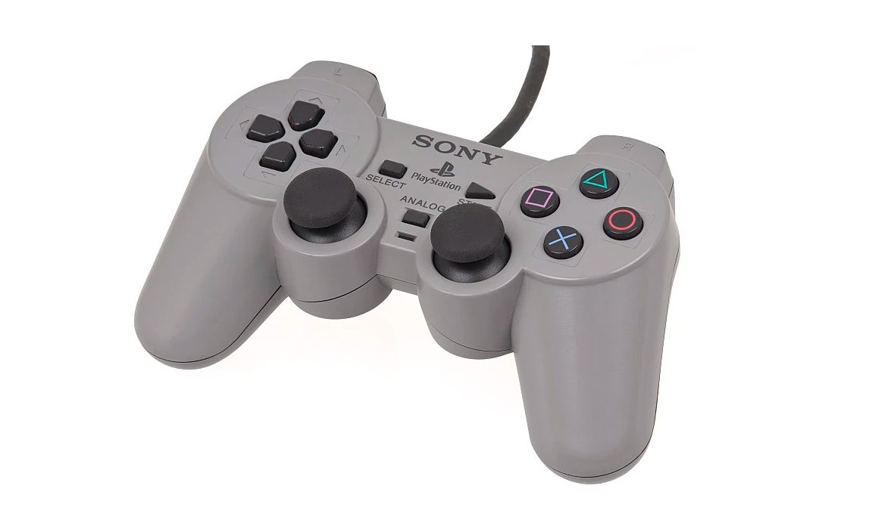
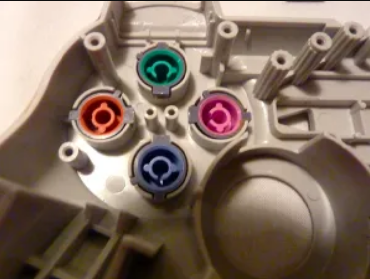
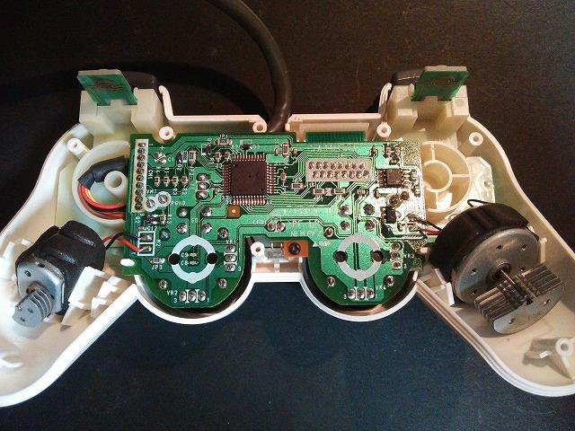
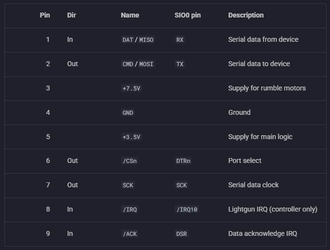
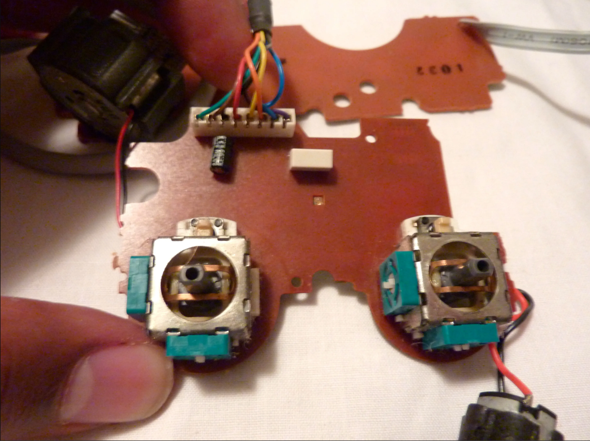
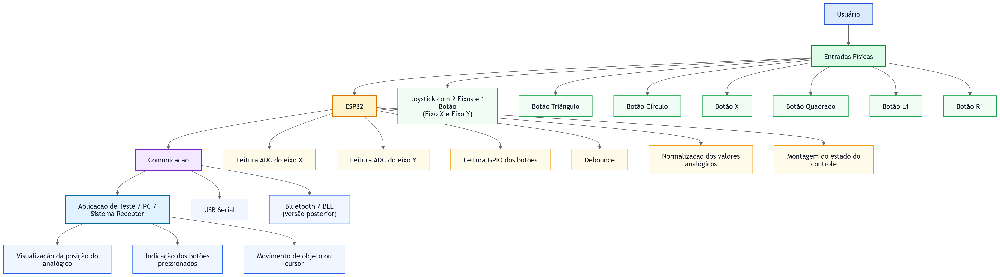
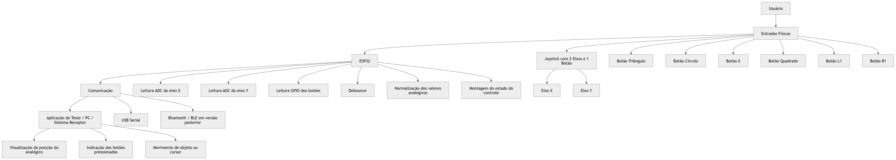

# DualShock 1

<div align="center">

</div>

## 1. Descrição do Produto Selecionado

O **DualShock 1**, também identificado pelo modelo **SCPH-1200**, é um controle desenvolvido pela Sony para o PlayStation original. Ele representa uma evolução em relação ao controle digital padrão do console, pois combina botões digitais, dois direcionais analógicos, botão de alternância de modo analógico e dois motores internos de vibração. Por reunir entradas mecânicas, leitura analógica, processamento interno, comunicação serial com o console e atuação por vibração, o DualShock 1 pode ser analisado como um sistema embarcado periférico.

A principal função do produto é permitir que o usuário envie comandos ao console em tempo real. Para isso, o controle transforma ações físicas, como pressionar botões e movimentar os sticks, em informações digitais transmitidas pelo cabo ao PlayStation. Além da entrada de comandos, o controle também recebe dados do console para acionar os motores de vibração, criando uma resposta tátil associada aos eventos do jogo.

O produto pertence ao segmento de acessórios para videogames domésticos. Seu uso ocorre principalmente em jogos que exigem interação rápida, controle direcional preciso e feedback físico ao jogador. A presença dos dois analógicos ampliou as possibilidades de controle em jogos tridimensionais, permitindo, por exemplo, separar a movimentação do personagem do controle de câmera. Já a vibração adicionou uma camada de resposta sensorial ao usuário, tornando colisões, impactos e eventos do jogo mais perceptíveis.

## 2. Funções Principais, Público-alvo e Contexto de Uso

As funções principais do DualShock 1 são:

- **Entrada digital de comandos:** feita por meio do direcional digital, botões de ação, botões superiores, Start, Select e botões L3/R3.
- **Entrada analógica de movimento:** feita por dois sticks analógicos, cada um com dois eixos de leitura.
- **Alternância entre modo digital e modo analógico:** realizada pelo botão Analog, com indicação visual por LED vermelho.
- **Feedback tátil:** realizado por dois motores de vibração internos.
- **Comunicação com o console:** feita por cabo, usando o conector proprietário do PlayStation e um protocolo serial síncrono.

O público-alvo do produto é formado por jogadores do PlayStation que precisam de uma interface de controle manual para jogos digitais. O contexto de uso é o entretenimento interativo doméstico, em que o tempo de resposta, a ergonomia, a confiabilidade dos botões e a estabilidade dos analógicos são fatores essenciais.

No modo digital, o controle funciona de maneira semelhante ao controle original do PlayStation, enviando apenas estados de botões. No modo analógico, os sticks passam a ser considerados na comunicação com o console, permitindo leituras contínuas de posição. Essa diferença é importante porque mostra que o DualShock 1 não é apenas um controle com mais botões, mas um periférico com estados de funcionamento distintos.

A vibração também faz parte da experiência de uso. O console pode enviar comandos para acionar os motores internos, permitindo que o controle responda fisicamente a eventos do jogo. Essa função é uma das características centrais da linha DualShock e explica o nome do produto, associado aos dois motores de vibração.

<div align="center">

</div>

## 3. Componentes, Sensores e Atuadores Utilizados

O DualShock 1 é composto por uma carcaça plástica, placas internas, botões, membranas condutivas, dois conjuntos de joystick analógico, LED de indicação, cabo de conexão, circuito de controle e dois motores de vibração. Em modelos documentados do controle, a placa principal contém o circuito responsável por ler os comandos, organizar os dados e se comunicar com o console.

<div align="center">

</div>


Os principais componentes de entrada são os botões digitais e os dois sticks analógicos. Os botões funcionam por fechamento de contato elétrico na placa, normalmente com auxílio de membranas condutivas. Quando o usuário pressiona um botão, o contato é fechado e o circuito interno registra a alteração de estado.

Os sticks analógicos funcionam como sensores de posição. Cada stick possui dois eixos, um horizontal e um vertical, que representam a movimentação do usuário. Esses eixos são associados a potenciômetros, que variam sua resistência de acordo com a posição do stick. Essa variação é lida pelo circuito interno e convertida em valores usados pelo console para interpretar a direção e a intensidade do movimento.

Os atuadores principais são os dois motores de vibração. O controle utiliza um motor maior em um dos lados e um motor menor no outro, permitindo diferentes intensidades e padrões de vibração. O motor maior é mais adequado para vibrações mais fortes, enquanto o motor menor pode ser usado para respostas mais rápidas ou leves.

O produto também possui um LED vermelho associado ao modo analógico. Esse LED funciona como uma interface visual simples, indicando ao usuário quando o modo analógico está ativado. Portanto, mesmo sendo um produto simples externamente, o DualShock 1 reúne entradas digitais, entradas analógicas, saída visual e saída tátil.

De forma resumida, os principais elementos do controle são:

| Elemento | Tipo | Função |
| --- | --- | --- |
| Direcional digital | Entrada digital | Movimento em oito direções por combinações de contatos |
| Botões de ação | Entrada digital | Comandos principais do jogo |
| Botões L1, L2, R1 e R2 | Entrada digital | Comandos adicionais acionados pelos dedos indicadores |
| Botões Start e Select | Entrada digital | Controle de menus, pausa e seleção |
| Botões L3 e R3 | Entrada digital | Clique dos próprios sticks analógicos |
| Dois sticks analógicos | Entrada analógica | Leitura contínua de posição em dois eixos por stick |
| Botão Analog | Entrada digital | Alternância do modo de funcionamento |
| LED vermelho | Saída visual | Indicação do modo analógico |
| Dois motores de vibração | Atuador | Feedback tátil ao jogador |
| Circuito integrado de controle | Processamento | Leitura das entradas, controle de estado e comunicação com o console |
| Cabo e conector PlayStation | Comunicação/alimentação | Troca de dados e fornecimento de energia |

## 4. Tecnologias de Comunicação e Controle Embarcadas

A comunicação entre o DualShock 1 e o PlayStation é feita por um barramento serial próprio do console. Esse barramento é frequentemente descrito como semelhante ao SPI, pois utiliza comunicação síncrona com linha de clock e troca serial de dados. No entanto, ele não deve ser tratado como SPI padrão puro, pois possui particularidades próprias, como a linha de atenção do periférico e a linha de confirmação de recebimento.

<div align="center">

</div>

As principais linhas envolvidas na comunicação são:

| Linha | Função |
| --- | --- |
| DATA | Envio de dados do controle para o console |
| COMMAND | Envio de comandos do console para o controle |
| ATT | Seleção/atenção do periférico |
| CLK | Clock da comunicação serial |
| ACK | Confirmação enviada pelo controle |
| VCC | Alimentação lógica |
| GND | Referência elétrica |
| Alimentação dos motores | Energia dedicada à vibração |

O console atua como mestre da comunicação, interrogando o controle em intervalos regulares. O controle responde com informações sobre o estado dos botões, dos sticks e do modo de operação. Em determinadas trocas, o console também pode enviar dados relacionados ao controle dos motores de vibração.

Essa arquitetura mostra que o controle não opera de forma autônoma; ele depende do console para ser interrogado e para receber comandos de atuação. Ainda assim, internamente ele possui lógica embarcada suficiente para organizar os estados dos botões, converter as posições dos analógicos, indicar o modo ativo e responder corretamente ao protocolo.

Do ponto de vista de controle embarcado, o DualShock 1 utiliza uma lógica de funcionamento baseada em estados. O modo digital e o modo analógico alteram o tipo de informação retornada ao console. O botão Analog e o LED estão ligados a essa lógica de modo, enquanto os comandos vindos do console podem influenciar a forma como o controle se comporta durante o jogo.

## 5. Análise Técnica do Funcionamento

O funcionamento do DualShock 1 pode ser entendido como um ciclo contínuo de leitura, processamento, comunicação e atuação. Primeiro, o usuário interage fisicamente com o controle. Essa interação pode ser o pressionamento de um botão, o deslocamento de um stick ou o acionamento do botão Analog. Em seguida, o circuito interno identifica essas alterações e prepara os dados para envio ao console.

No caso dos botões digitais, o funcionamento é binário: pressionado ou não pressionado. Já nos sticks analógicos, o funcionamento é contínuo. Cada eixo do stick gera um valor proporcional à sua posição. Em repouso, o stick tende a retornar ao centro; ao ser deslocado, o valor lido muda conforme a direção e a intensidade do movimento.

<div align="center">

</div>

Quando o console solicita o estado do controle, o circuito interno transmite os dados pelo barramento serial. Esses dados representam o estado atual dos botões e, se o modo analógico estiver ativo, também as posições dos sticks. A comunicação ocorre em baixa latência, pois o controle precisa responder rapidamente para que os comandos do jogador sejam refletidos no jogo sem atraso perceptível.

A vibração funciona no sentido oposto. Nesse caso, o console envia dados ao controle indicando como os motores devem ser acionados. O controle recebe esses comandos e ativa seus motores internos. A existência de dois motores permite combinações diferentes de intensidade e sensação, criando feedbacks táteis mais variados do que um único motor simples.

O botão Analog altera o modo de operação do controle. Quando o modo analógico está desativado, o controle se comporta de maneira próxima ao controle digital original. Quando o modo analógico está ativado, os sticks passam a fazer parte dos dados enviados ao console. O LED vermelho serve como indicação direta desse estado para o usuário.

Assim, o funcionamento técnico do produto envolve:

- leitura de contatos digitais;
- leitura de sinais analógicos dos sticks;
- controle de modo digital/analógico;
- comunicação serial com o console;
- acionamento de LED;
- acionamento de motores de vibração;
- organização dos dados em um protocolo compreendido pelo PlayStation.

Essa combinação torna o DualShock 1 um exemplo relevante de sistema embarcado de interface homem-máquina, pois ele traduz ações físicas humanas em comandos digitais e também traduz eventos digitais do jogo em resposta física ao usuário.

## 6. Principais Módulos do Sistema

O DualShock 1 pode ser dividido em módulos funcionais. Essa divisão ajuda a entender o produto como um sistema embarcado e facilita uma futura proposta de reprodução com ESP32.

<div align="center">

</div>

### 6.1 Módulo de Entrada Digital

Esse módulo inclui o direcional digital, os botões de ação, os botões superiores, Start, Select, L3, R3 e o botão Analog. Sua função é detectar comandos discretos do usuário. Cada botão possui dois estados principais: pressionado ou não pressionado.

### 6.2 Módulo de Entrada Analógica

Esse módulo é formado pelos dois sticks analógicos. Cada stick possui dois eixos de leitura, resultando em quatro sinais analógicos principais. A função desse módulo é medir a posição dos sticks de forma contínua, permitindo controle proporcional de movimento, câmera, direção ou intensidade de ação no jogo.

### 6.3 Módulo de Processamento e Controle

Esse módulo é representado pelo circuito integrado principal e pelos componentes auxiliares da placa. Ele é responsável por ler os estados dos botões, interpretar os sinais dos analógicos, controlar o modo de funcionamento, responder ao protocolo do console e comandar os atuadores internos.

### 6.4 Módulo de Comunicação

Esse módulo inclui o cabo, o conector e as linhas de comunicação serial com o PlayStation. Sua função é permitir a troca de dados entre o controle e o console. É por esse módulo que o console consulta o estado do controle e envia comandos relacionados à vibração.

### 6.5 Módulo de Atuação Tátil

Esse módulo é formado pelos dois motores de vibração e pelo circuito de acionamento. Sua função é fornecer feedback físico ao jogador. Os motores transformam comandos elétricos em vibração mecânica perceptível nas mãos do usuário.

### 6.6 Módulo de Interface Visual

Esse módulo é composto pelo LED vermelho do modo analógico. Ele informa ao usuário se o controle está operando em modo analógico. Embora simples, esse módulo é importante porque torna visível um estado interno do controle.

### 6.7 Módulo Mecânico e Ergonômico

Esse módulo inclui a carcaça, os botões físicos, as borrachas condutivas, as alavancas dos sticks e a organização interna das placas. Sua função é garantir que o controle possa ser usado confortavelmente e suporte uso repetitivo.

## 7. Tecnologias Críticas

A primeira tecnologia crítica do DualShock 1 é a **comunicação serial com o console**. O controle precisa responder às solicitações do PlayStation com baixa latência e no formato esperado pelo protocolo. Como o barramento possui linhas específicas de comando, dados, clock, atenção e confirmação, a temporização correta é essencial para que o console reconheça o periférico e interprete seus comandos.

A segunda tecnologia crítica é a **leitura analógica dos sticks**. Diferentemente dos botões digitais, os sticks precisam representar variações contínuas de posição. Isso exige leitura estável, definição correta de centro, tratamento de ruído e interpretação adequada dos extremos de movimento. Qualquer instabilidade nessa leitura pode causar comandos imprecisos, como movimentação involuntária ou dificuldade de centralização.

A terceira tecnologia crítica é o **acionamento dos motores de vibração**. O controle utiliza dois motores com comportamentos diferentes, exigindo controle adequado de energia e acionamento. Como motores consomem mais corrente do que sinais lógicos simples, eles dependem de um estágio de acionamento apropriado, separado da lógica de leitura dos botões e comunicação.

A quarta tecnologia crítica é a **máquina de estados do modo digital/analógico**. O controle precisa alternar corretamente entre os modos, refletir esse estado no LED e alterar o conteúdo dos dados enviados ao console. Isso mostra que existe uma lógica embarcada interna responsável por coordenar o comportamento do produto.

A quinta tecnologia crítica é a **robustez eletromecânica**. O DualShock 1 foi projetado para uso manual intenso, com pressionamentos repetidos, movimentos bruscos dos sticks e vibração durante o jogo. Portanto, a disposição das placas, a qualidade dos contatos, a estrutura dos botões e a fixação dos motores são partes importantes do funcionamento real do produto.

A sexta tecnologia crítica é a **integração entre entrada e feedback**. O DualShock 1 não apenas envia comandos ao console; ele também recebe comandos do jogo para produzir vibração. Essa característica torna o produto uma interface bidirecional: o usuário controla o sistema, e o sistema responde fisicamente ao usuário.

## 8. Proposta de Reprodução com ESP32

A proposta de reprodução consiste em implementar uma versão conceitual e reduzida do DualShock 1, focada em seu núcleo funcional como dispositivo de entrada. O objetivo não é replicar o controle original de forma completa ou fiel em todos os seus aspectos físicos, eletrônicos e mecânicos, mas sim reproduzir a função central do produto: ler comandos manuais analógicos e digitais por meio de um sistema embarcado e transmitir esses comandos para um sistema receptor.

Neste recorte, serão reproduzidos:

- **1 analógico**;
- **4 botões principais**;
- **2 botões superiores**, correspondentes a L1 e R1.

Elementos como segundo analógico, direcional digital, Start, Select, botão Analog, L2, R2, L3, R3, LED indicador, motores de vibração, carcaça ergonômica e protocolo proprietário do PlayStation não fazem parte do escopo inicial da reprodução. Esses elementos pertencem ao produto completo, mas não são necessários para demonstrar o princípio embarcado central do controle.

A ESP32 atuará como unidade de leitura, processamento e comunicação. Ela será responsável por receber os sinais dos componentes de entrada, interpretar o estado atual do controle e enviar esses dados para um computador, aplicação de teste ou outro sistema receptor.

Os componentes utilizados, de acordo com a lista de sensores e atuadores disponíveis, são:

| Função reproduzida | Componente da lista | Quantidade |
| --- | --- | --- |
| Analógico com eixo X e eixo Y | **Joystick com 2 Eixos e 1 Botão** | 1 |
| Botão Triângulo | **Botão** | 1 |
| Botão Círculo | **Botão** | 1 |
| Botão X | **Botão** | 1 |
| Botão Quadrado | **Botão** | 1 |
| Botão L1 | **Botão** | 1 |
| Botão R1 | **Botão** | 1 |

Portanto, a reprodução necessita de:

- **1x Joystick com 2 Eixos e 1 Botão**;
- **6x Botão**.

O joystick será conectado a entradas analógicas da ESP32, permitindo a leitura dos eixos horizontal e vertical. Cada eixo fornecerá um valor variável, que representa a posição do analógico. Já os seis botões serão conectados a entradas digitais da ESP32, permitindo identificar se cada comando está pressionado ou solto.

Na implementação conceitual, a ESP32 deve executar continuamente as seguintes tarefas:

1. ler os valores analógicos dos eixos X e Y do joystick;
2. ler o estado digital dos seis botões;
3. aplicar tratamento simples de ruído e debounce;
4. organizar os dados em uma estrutura de estado do controle;
5. enviar o estado atual para o sistema receptor.

Uma estrutura simples de estado poderia conter os seguintes campos:

```text
analogico_x
analogico_y
botao_triangulo
botao_circulo
botao_x
botao_quadrado
botao_l1
botao_r1
```

A transmissão pode ser feita inicialmente por USB Serial, por ser a alternativa mais simples para testes. Nesse caso, a ESP32 envia periodicamente uma linha de texto com os valores lidos. Um exemplo de mensagem seria:

```text
AX=2048;AY=1800;TRI=0;CIR=1;X=0;QUA=0;L1=1;R1=0
```

Nessa representação, `AX` e `AY` indicam os valores do analógico, enquanto os demais campos indicam o estado dos botões. A aplicação receptora pode interpretar `1` como botão pressionado e `0` como botão solto, ou o inverso, dependendo da lógica elétrica adotada.

Essa abordagem é suficiente para demonstrar a essência do funcionamento do DualShock 1: entradas físicas acionadas pelo usuário são convertidas em sinais elétricos, interpretadas por um sistema embarcado e enviadas como comandos digitais para outro sistema.

## 9. Diagrama Conceitual do Sistema

<div align="center">

</div>

O diagrama conceitual da reprodução com ESP32 pode ser representado em blocos. O usuário interage com os componentes físicos de entrada; a ESP32 realiza a leitura e o tratamento dos sinais; em seguida, os dados são enviados para uma aplicação de teste ou sistema receptor.

```text
Usuário
  |
  v
Entradas físicas
  |-- Joystick com 2 Eixos e 1 Botão
  |     |-- Eixo X
  |     |-- Eixo Y
  |
  |-- Botão Triângulo
  |-- Botão Círculo
  |-- Botão X
  |-- Botão Quadrado
  |-- Botão L1
  |-- Botão R1
  |
  v
ESP32
  |-- Leitura ADC do eixo X
  |-- Leitura ADC do eixo Y
  |-- Leitura GPIO dos botões
  |-- Debounce
  |-- Normalização dos valores analógicos
  |-- Montagem do estado do controle
  |
  v
Comunicação
  |-- USB Serial
  |-- Bluetooth/BLE, em uma versão posterior
  |
  v
Aplicação de teste / PC / sistema receptor
```

O bloco de **entradas físicas** representa a parte do DualShock 1 escolhida para reprodução. O bloco da **ESP32** substitui o circuito de controle interno do produto original no protótipo, sendo responsável por ler sinais analógicos e digitais. O bloco de **comunicação** define como os comandos serão enviados para o sistema externo. Por fim, a **aplicação de teste** permite visualizar e validar o comportamento do controle.

Em uma demonstração prática, a aplicação receptora poderia exibir:

- posição atual do analógico;
- indicação visual dos botões pressionados;
- histórico simples dos comandos recebidos;
- resposta em tela a partir dos comandos, como movimentar um objeto ou cursor.

Assim, mesmo sem reproduzir o controle completo, o sistema demonstra o fluxo principal de um controle embarcado: entrada física, leitura eletrônica, processamento e comunicação.

## 10. Limitações e Desafios Esperados

A principal limitação da proposta é o escopo reduzido. O protótipo não busca implementar todos os recursos do DualShock 1. O produto original possui dois analógicos, direcional digital, botões Start e Select, botão Analog, L2/R2, L3/R3, LED indicador, motores de vibração e comunicação proprietária com o PlayStation. A reprodução proposta se limita a um analógico e seis botões digitais.

Essa limitação é aceitável porque o objetivo do protótipo é reproduzir o núcleo funcional do controle, não criar uma réplica 1:1. O foco está em demonstrar como entradas manuais podem ser capturadas por sensores simples e processadas por uma ESP32.

Outro desafio está na leitura do joystick. O componente **Joystick com 2 Eixos e 1 Botão** é um módulo genérico e pode apresentar variações nos valores analógicos mesmo quando está parado. Por isso, será necessário aplicar uma zona morta no centro do analógico, evitando que pequenas oscilações sejam interpretadas como movimento real.

Também será necessário calibrar os valores mínimos, máximos e centrais do joystick. Como a leitura ADC da ESP32 pode variar de acordo com alimentação, ruído elétrico e características do módulo, o sistema deve normalizar os valores antes de enviá-los ao receptor.

Nos botões digitais, o principal desafio é o debounce. Botões mecânicos podem gerar pequenas oscilações elétricas no instante do pressionamento ou soltura. Sem tratamento, a ESP32 pode interpretar um único clique como vários acionamentos rápidos. O debounce pode ser feito por software, ignorando mudanças muito próximas no tempo.

A comunicação com o computador também impõe decisões. Pela USB Serial, a implementação é simples e adequada para validação didática, mas o dispositivo não será reconhecido automaticamente como um controle de videogame comum. Para que o protótipo seja reconhecido como controle HID, seria necessário adotar uma solução com Bluetooth/BLE HID ou uma placa com suporte mais adequado a USB nativo, dependendo da arquitetura escolhida.

Por fim, existe uma limitação mecânica. O DualShock 1 original possui carcaça ergonômica, botões encaixados, membranas condutivas e sticks integrados à estrutura do controle. Em um protótipo com ESP32, a montagem provavelmente será feita em protoboard, placa perfurada ou estrutura impressa, o que reduz a semelhança física com o produto original. Ainda assim, a lógica de funcionamento embarcado pode ser demonstrada de forma clara.

## 11. Pesquisa Bibliográfica e Tecnológica

A pesquisa bibliográfica e tecnológica relacionada ao DualShock 1 pode ser organizada em dois grupos principais: tecnologias que viabilizam o produto e estudos sobre aplicação ou uso de interfaces de controle em sistemas interativos.

### 11.1 Tecnologias que viabilizam o produto

O primeiro eixo tecnológico é a **interface háptica**. O DualShock 1 se destacou por integrar motores de vibração ao controle, permitindo que eventos digitais do jogo fossem convertidos em resposta tátil. Trabalhos sobre interfaces hápticas ajudam a compreender a função da vibração como forma de realimentação sensorial ao usuário.

O segundo eixo é a **interface tátil e vibrotátil**. A vibração em controles de videogame é uma aplicação prática de feedback tátil. A literatura sobre displays táteis e resposta vibrotátil mostra como sinais mecânicos podem transmitir informações ao usuário sem depender apenas da visão ou audição.

O terceiro eixo é a **interação humano-computador por dispositivos de entrada manual**. O DualShock 1 depende da capacidade do usuário de acionar botões e mover analógicos com rapidez e precisão. Estudos clássicos de interação humano-computador, como os relacionados à lei de Fitts, ajudam a explicar a importância da posição, tamanho e resposta dos comandos físicos.

O quarto eixo é a **leitura analógica e conversão analógico-digital**. A reprodução com ESP32 depende diretamente da leitura de valores contínuos do joystick. Para isso, é necessário compreender conceitos como ADC, calibração, zona morta, ruído de leitura e normalização de valores. Esses aspectos aparecem na documentação técnica da ESP32 e são centrais para implementar o analógico do protótipo.

### 11.2 Aplicação e uso do produto

O primeiro campo de aplicação é o **controle de jogos tridimensionais**. A presença de analógicos permite comandos proporcionais, ao contrário dos botões digitais, que indicam apenas pressionado ou solto. Isso é importante em jogos que exigem controle gradual de movimentação, direção ou câmera.

O segundo campo é a **ergonomia de controles manuais**. A disposição dos botões principais, superiores e analógicos influencia diretamente a facilidade de uso. O DualShock 1 consolidou um formato que continuou sendo usado em gerações posteriores, indicando a relevância do seu arranjo físico.

O terceiro campo é a **resposta em tempo real**. Em jogos digitais, atrasos perceptíveis entre o comando do jogador e a resposta do sistema prejudicam a experiência de uso. Por isso, controles precisam operar com leitura frequente, comunicação estável e baixa latência.

O quarto campo é a **experiência sensorial no jogo**. A vibração permite que o jogador receba uma resposta física associada a colisões, impactos, terreno, dano ou outros eventos. Mesmo que o protótipo inicial com ESP32 não implemente vibração, esse recurso faz parte da análise do produto original e ajuda a compreender por que o DualShock 1 foi um marco na evolução dos controles.

Dessa forma, a pesquisa bibliográfica sustenta tanto a análise do produto real quanto a proposta de reprodução. Os artigos sobre háptica, feedback tátil e interação humano-computador explicam as tecnologias do DualShock 1, enquanto a documentação técnica da ESP32 apoia a implementação do recorte escolhido para o protótipo.

## 12. Comparativo com Produtos Similares

O DualShock 1 faz parte de uma evolução histórica dos controles de videogame. Antes dele, muitos controles eram predominantemente digitais, com direcional e botões simples. Durante a mesma geração, alguns produtos passaram a introduzir entrada analógica e, posteriormente, feedback por vibração. O DualShock 1 se destaca por reunir dois analógicos, botões digitais e vibração em um formato que influenciou controles posteriores.

| Produto | Plataforma / geração | Entradas analógicas | Botões principais | Botões superiores | Vibração | Relação com o DualShock 1 |
| --- | --- | ---: | ---: | ---: | --- | --- |
| Controle digital do PlayStation | PlayStation 1 | Não possui | 4 | 4 | Não | Antecessor direto. Mantém o formato básico, mas sem analógicos e sem vibração. |
| PlayStation Dual Analog Controller | PlayStation 1 | 2 analógicos | 4 | 4 | Algumas versões possuem vibração | Produto intermediário entre o controle digital e o DualShock 1. |
| Sony DualShock 1 | PlayStation 1 | 2 analógicos | 4 | 4 | Sim | Produto estudado. Integra botões digitais, dois analógicos e dois motores de vibração. |
| Sony DualShock 2 | PlayStation 2 | 2 analógicos | 4 | 4 | Sim | Sucessor direto. Mantém o formato geral e amplia a compatibilidade com o PlayStation 2. |
| Nintendo 64 Controller | Nintendo 64 | 1 analógico | 6 botões frontais principais, considerando A, B e C-buttons | 2 gatilhos principais | Não nativo no controle; depende do acessório Rumble Pak | Controle da mesma geração, conhecido por popularizar o uso de analógico em jogos 3D. |
| Sega Saturn 3D Control Pad | Sega Saturn | 1 controle analógico | 6 | 2 | Não | Controle da mesma época com foco em jogos 3D e entrada analógica. |
| Dreamcast Controller | Sega Dreamcast | 1 analógico | 4 | 2 gatilhos analógicos | Sim, por acessório | Controle posterior, com entrada analógica e expansão modular. |

Considerando o escopo do protótipo, a reprodução com ESP32 se aproxima mais de uma versão reduzida de um controle analógico da quinta geração de consoles. Ela não reproduz todos os recursos do DualShock 1, mas preserva a ideia central de entrada manual analógica e digital.

| Função | DualShock 1 original | Protótipo com ESP32 |
| --- | --- | --- |
| Analógico | 2 sticks analógicos | 1 **Joystick com 2 Eixos e 1 Botão** |
| Botões principais | 4 botões de ação | 4x **Botão** |
| Botões L1/R1 | 2 botões superiores | 2x **Botão** |
| L2/R2 | Presentes | Não implementados no escopo inicial |
| Start/Select | Presentes | Não implementados no escopo inicial |
| Direcional digital | Presente | Não implementado no escopo inicial |
| Vibração | 2 motores internos | Não implementada no escopo inicial |
| LED de modo analógico | Presente | Não implementado no escopo inicial |
| Comunicação | Cabo proprietário PlayStation | USB Serial inicialmente; Bluetooth/BLE em possível evolução |
| Estrutura física | Produto industrial ergonômico | Protótipo didático com ESP32 e componentes discretos |

O comparativo mostra que a proposta não pretende substituir o DualShock 1 completo. O valor do protótipo está em reproduzir o princípio central do produto: um conjunto de entradas físicas interpretadas por um sistema embarcado e transmitidas como comandos a outro sistema.

## Referências Bibliográficas

[1] KORTH, Martin. *PlayStation Specifications - Controllers and Memory Cards*. psx-spx. Disponível em: https://psx-spx.consoledev.net/controllersandmemorycards/. Acesso em: 30 jun. 2026.

[2] KORTH, Martin. *PlayStation Specifications - Pinouts*. psx-spx. Disponível em: https://psx-spx.consoledev.net/pinouts/. Acesso em: 30 jun. 2026.

[3] NFG GAMES; GAMESX. *PlayStation Controllers*. GamesX Wiki. Disponível em: https://gamesx.com/wiki/doku.php?id=controls:playstation_controller. Acesso em: 30 jun. 2026.

[4] MAKING STUDIO. *PlayStation DualShock 1 Controller Deconstruction*. Making Studio, 2014. Disponível em: https://makingstudio.blog/2014/09/15/playstation-dualshock-1-controller-deconstruction/. Acesso em: 30 jun. 2026.

[5] SONY COMPUTER ENTERTAINMENT. *PlayStation 2 Programmer Tool Runtime Library: Controller Library*. Sony Computer Entertainment, 2000. Referência técnica sobre biblioteca de controle e compatibilidade da família PlayStation.

[6] ESPRESSIF SYSTEMS. *ESP32 Series Datasheet*. Espressif Systems. Disponível em: https://www.espressif.com/sites/default/files/documentation/esp32_datasheet_en.pdf. Acesso em: 30 jun. 2026.

[7] ESPRESSIF SYSTEMS. *Analog to Digital Converter (ADC) - ESP32 - ESP-IDF Programming Guide*. Disponível em: https://docs.espressif.com/projects/esp-idf/en/stable/esp32/api-reference/peripherals/adc/index.html. Acesso em: 30 jun. 2026.

[8] ESPRESSIF SYSTEMS. *Analog to Digital Converter Calibration Driver - ESP32 - ESP-IDF Programming Guide*. Disponível em: https://docs.espressif.com/projects/esp-idf/en/stable/esp32/api-reference/peripherals/adc/adc_calibration.html. Acesso em: 30 jun. 2026.

[9] ESPRESSIF SYSTEMS. *LED Control (LEDC) - ESP32 - ESP-IDF Programming Guide*. Disponível em: https://docs.espressif.com/projects/esp-idf/en/stable/esp32/api-reference/peripherals/ledc.html. Acesso em: 30 jun. 2026.

[10] HAYWARD, Vincent; ASTLEY, Oliver R.; CRUZ-HERNANDEZ, Manuel; GRANT, Danny; ROBLES-DE-LA-TORRE, Gabriel. *Haptic interfaces and devices*. Sensor Review, v. 24, n. 1, p. 16-29, 2004. DOI: 10.1108/02602280410515770.

[11] JONES, Lynette A.; SARTER, Nadine B. *Tactile displays: Guidance for their design and application*. Human Factors, v. 50, n. 1, p. 90-111, 2008. DOI: 10.1518/001872008X250638.

[12] MACKENZIE, I. Scott. *Fitts' law as a research and design tool in human-computer interaction*. Human-Computer Interaction, v. 7, n. 1, p. 91-139, 1992. DOI: 10.1207/s15327051hci0701_3.
